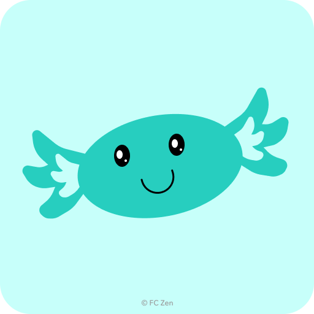

# 
**Équipe FC-Zen - Projet BUT3 Informatique**

  

Nom de l'équipe : FC-Zen <i>(FC for Fast Coding)</i>

### 
Équipe de développeur composé d'étudiant en BUT Informatique 3ème année

---

### Membres de l'équipe

- **Kellian BREDEAU**  
  - 🏷️ **Rôle** : Responsable Back-End 🧠  
  - 🔗 **GitHub** : [InkyYuu](https://github.com/InkyYuu)
  - 📧 **Email** : *bredeaukellian@gmail.com*

- **Helena CHEVALIER**  
  - 🏷️ **Rôle** : Cheffe de projet 👩‍💼  
  - 🔗 **GitHub** : [Artena8](https://github.com/Artena8) 
  - 📧 **Email** : *lna.chevalier@gmail.com*

- **Thivakar JEYASEELAN**  
  - 🏷️ **Rôle** : Responsable UI/UX 🎨  
  - 🔗 **GitHub** : [Thiiiv](https://github.com/Thiiiv)
  - 📧 **Email** : *thiiivpro@gmail.com*

- **Elias LAHLOUH**  
  - 🏷️ **Rôle** : Responsable Front-End 🖥️  
  - 🔗 **GitHub** : [Eliaslhl](https://github.com/Eliaslhl)
  - 📧 **Email** : *eliaslahlouh@gmail.com*

- **Loïc MAURITIUS**  
  - 🏷️ **Rôle** : Responsable Documentation 📝  
  - 🔗 **GitHub** : [LoicMauritius](https://github.com/LoicMauritius)
  - 📧 **Email** : *loicmauritius@gmail.com*

- **Taha SEFOUDINE**  
  - 🏷️ **Rôle** : Responsable Tests ✅  
  - 🔗 **GitHub** : [Taha-130](https://github.com/Taha-130)
  - 📧 **Email** : *tahathierry130@gmail.com*
